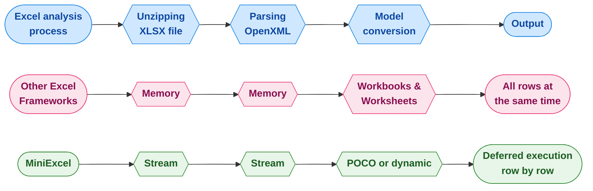
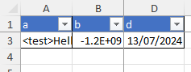
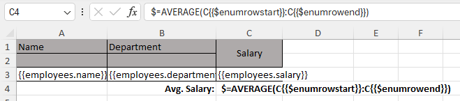
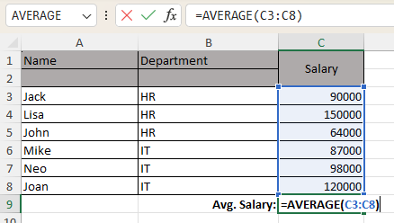

<div align="center">
    <p>
        <a href="https://www.nuget.org/packages/MiniExcel">
            
        </a>
        <a href="https://www.nuget.org/packages/MiniExcel">
            
        </a>
        <a href="https://ci.appveyor.com/project/mini-software/miniexcel/branch/master">
            
        </a>
        <a href="https://gitee.com/dotnetchina/MiniExcel">
            
        </a>
        <a href="https://github.com/mini-software/MiniExcel" rel="nofollow">
            
        </a>
        <a href="https://www.nuget.org/packages/MiniExcel">
            
        </a>
        <a href="https://deepwiki.com/mini-software/MiniExcel">
            
        </a>
    </p>
</div>

---

[](https://www.dotnetfoundation.org/)

<div align="center">
    <p>This project is part of the <a href="https://www.dotnetfoundation.org/">.NET Foundation</a> and operates under their <a href="https://www.dotnetfoundation.org/code-of-conduct">code of conduct</a>. </p>
</div>

---

<div align="center">
    <p><strong>
        <a href="README.md">English</a> | 
        <a href="README.zh-CN.md">简体中文</a> | 
        <a href="README.zh-Hant.md">繁體中文</a> | 
        <a href="https://openaitx.github.io/view.html?user=mini-software&amp;project=MiniExcel&amp;lang=ja">日本語</a> | 
        <a href="https://openaitx.github.io/view.html?user=mini-software&amp;project=MiniExcel&amp;lang=ko">한국어</a> | 
        <a href="https://openaitx.github.io/view.html?user=mini-software&amp;project=MiniExcel&amp;lang=hi">हिन्दी</a> | 
        <a href="https://openaitx.github.io/view.html?user=mini-software&amp;project=MiniExcel&amp;lang=th">ไทย</a> | 
        <a href="https://openaitx.github.io/view.html?user=mini-software&amp;project=MiniExcel&amp;lang=fr">Français</a> | 
        <a href="https://openaitx.github.io/view.html?user=mini-software&amp;project=MiniExcel&amp;lang=de">Deutsch</a> | 
        <a href="https://openaitx.github.io/view.html?user=mini-software&amp;project=MiniExcel&amp;lang=es">Español</a> | 
        <a href="https://openaitx.github.io/view.html?user=mini-software&amp;project=MiniExcel&amp;lang=it">Italiano</a> | 
        <a href="https://openaitx.github.io/view.html?user=mini-software&amp;project=MiniExcel&amp;lang=ru">Русский</a> | 
        <a href="https://openaitx.github.io/view.html?user=mini-software&amp;project=MiniExcel&amp;lang=pt">Português</a> | 
        <a href="https://openaitx.github.io/view.html?user=mini-software&amp;project=MiniExcel&amp;lang=nl">Nederlands</a> | 
        <a href="https://openaitx.github.io/view.html?user=mini-software&amp;project=MiniExcel&amp;lang=pl">Polski</a> | 
        <a href="https://openaitx.github.io/view.html?user=mini-software&amp;project=MiniExcel&amp;lang=ar">العربية</a> | 
        <a href="https://openaitx.github.io/view.html?user=mini-software&amp;project=MiniExcel&amp;lang=fa">فارسی</a> | 
        <a href="https://openaitx.github.io/view.html?user=mini-software&amp;project=MiniExcel&amp;lang=tr">Türkçe</a> | 
        <a href="https://openaitx.github.io/view.html?user=mini-software&amp;project=MiniExcel&amp;lang=vi">Tiếng Việt</a> | 
        <a href="https://openaitx.github.io/view.html?user=mini-software&amp;project=MiniExcel&amp;lang=id">Bahasa Indonesia</a>
    </strong></p>
</div>


---

<div align="center">
    If MiniExcel was useful to you please consider <a href="https://miniexcel.github.io">donating</a>, or simply <a href="https://github.com/mini-software/MiniExcel">starring</a> the project. A small gesture can make a big difference in improving the library!
</div>

---

MiniExcel is a simple and efficient Excel processing tool for .NET, specifically designed to minimize memory usage.

At present, most popular frameworks need to load all the data from an Excel document into memory to facilitate operations, but this may cause memory consumption problems. MiniExcel's approach is different: the data is processed row by row in a streaming manner, reducing the original consumption from potentially hundreds of megabytes to just a few megabytes, effectively preventing out-of-memory(OOM) issues.



### Features

- Minimizes memory consumption, preventing out-of-memory (OOM) errors and avoiding full garbage collections
- Enables real-time, row-level data operations for better performance on large datasets
- Supports LINQ with deferred execution, allowing for fast, memory-efficient paging and complex queries
- Lightweight, without the need for Microsoft Office or COM+ components, and a DLL size under 600KB
- Simple and intuitive API to read, write, and fill Excel documents


## Usage
### Installation

You can download the full package from [NuGet](https://www.nuget.org/packages/MiniExcel):

```bash
dotnet add package MiniExcel
```

This package will contain the assemblies with both Excel and Csv functionalities, along with the original `v1.x` methods' signatures.
~~If you don't care for those you can also install the Excel and Csv packages separately:~~
We're still pondering whether this is the best way to move forward with the library, and if we do this is how you'll be able to add the separate packages:

```bash
dotnet add package MiniExcel.Core
```

```bash
dotnet add package MiniExcel.Csv
```

### Quickstart

#### Importing

Firstly, you have to get an importer. The available ones are the `OpenXmlImporter` and the `CsvImporter`:
```csharp
var importer = MiniExcel.Importers.GetOpenXmlImporter();

// or

var importer = MiniExcel.Importers.GetCsvImporter();
```

You can then use it to query Excel or csv documents as dynamic objects, or map them directly to a suitable strong type:
```csharp
var query = importer.Query(excelPath);

// or 

var query = importer.Query<YourStrongType>(csvPath);
```

Finally, you can materialize the results or enumerate them and perform some custom logic:
```csharp
var rows = query.ToList();

// or 

foreach (var row in query)
{
    // your logic here 
}
```

MiniExcel also fully supports `IAsyncEnumerable`, allowing you to perform all sorts of asynchronous operations:
```csharp
var query = importer.QueryAsync(inputPath);
await foreach (var row in query)
{
    // your asynchronous logic here 
}
```

#### Exporting

Similarly to what was described before, the first thing you need to do is getting an exporter:
```csharp
var exporter = MiniExcel.Exporters.GetOpenXmlExporter();

// or

var exporter = MiniExcel.Exporters.GetCsvExporter();
```

You can then use it to create an Excel or csv document from a `IEnumerable` whose generic type can be some strong type, anonymous type or even a `IDictionary<string, object>`:
```csharp
var values = new[] // can also be a strong type 
{
    new { Column1 = "MiniExcel", Column2 = 1 },
    new { Column1 = "Github", Column2 = 2 }
}
exporter.Export(outputPath, values);

// or

List<Dictionary<string, object>> values =
[
    new() { { "Column1", "MiniExcel" }, { "Column2", 1 } },
    new() { { "Column1", "Github" }, { "Column2", 2 } }
];
exporter.Export(outputPath, values);
```

The exporters also fully support asynchronous operations: 
```csharp
await exporter.ExportAsync(outputPath, values);
```

### Release Notes

If you're migrating from a `1.x` version, please check the [upgrade notes](V2-upgrade-notes.md).

You can check the full release notes [here](docs).

### TODO

Check what we are planning for future versions [here](https://github.com/mini-software/MiniExcel/projects/1?fullscreen=true).

### Performance

The code for the benchmarks can be found in [MiniExcel.Benchmarks](benchmarks/MiniExcel.Benchmarks/Program.cs).

The file used to test performance is [**Test1,000,000x10.xlsx**](benchmarks/MiniExcel.Benchmarks/Test1%2C000%2C000x10.xlsx), a 32MB document containing 1,000,000 rows * 10 columns whose cells are filled with the string "HelloWorld".

To run all the benchmarks use:

```bash
dotnet run -project .\benchmarks\MiniExcel.Benchmarks -c Release -f net9.0 -filter * --join
```

You can find the benchmarks' results for the latest release [here](benchmarks/results).


## Documentation

- [Query/Import](#docs-import)
- [Create/Export](#docs-export)
- [Excel Template](#docs-template)
- [Attributes and configuration](#docs-attributes)
- [CSV specifics](#docs-csv)
- [Other functionalities](#docs-other)
- [Fluent Cell Mapping](#docs-mapping)
- [FAQ](#docs-faq)
- [Limitations](#docs-limitations)


### Query/Import  <a name="docs-import" />

#### 1. Execute a query and map the results to a strongly typed IEnumerable

```csharp
public class UserAccount
{
    public Guid ID { get; set; }
    public string Name { get; set; }
    public DateTime BoD { get; set; }
    public int Age { get; set; }
    public bool VIP { get; set; }
    public decimal Points { get; set; }
}

var importer = MiniExcel.Importers.GetOpenXmlImporter();
var rows = importer.Query<UserAccount>(path);

// or 

using var stream = File.OpenRead(path);
var rows = importer.Query<UserAccount>(stream);
```

#### 2. Execute a query and map it to a list of dynamic objects

By default no header will be used and the dynamic keys will be `.A`, `.B`, `.C`, etc..:

| MiniExcel | 1 |
|-----------|---|
| Github    | 2 |

```csharp
var importer = MiniExcel.Importers.GetOpenXmlImporter();
var rows = importer.Query(path).ToList();

// rows[0].A = "MiniExcel"
// rows[0].B = 1
// rows[1].A = "Github" 
// rows[1].B = 2
```

You can also specify that a header must be used, in which case the dynamic keys will be mapped to it:

| Name      | Value |
|-----------|-------|
| MiniExcel | 1     |
| Github    | 2     |


```csharp
var importer = MiniExcel.Importers.GetOpenXmlImporter();
var rows = importer.Query(path, useHeaderRow: true).ToList();

// rows[0].Name = "MiniExcel"
// rows[0].Value = 1
// rows[1].Name = "Github" 
// rows[1].Value = 2
```

#### 3. Query Support for LINQ extensions First/Take/Skip etc...

e.g: Query the tenth row by skipping the first 9 and taking the first

```csharp
var importer = MiniExcel.Importers.GetOpenXmlImporter();
var tenthRow = importer.Query(path).Skip(9).First();
```

#### 4. Specify the Excel sheet to query from

```csharp
var excelImporter = MiniExcel.Importers.GetOpenXmlImporter();
excelImporter.Query(path, sheetName: "SheetName");
```

#### 5. Get the sheets' names from an Excel workbook

```csharp
var excelImporter = MiniExcel.Importers.GetOpenXmlImporter();
var sheetNames = excelImporter.GetSheetNames(path);
```

#### 6. Get the columns' names from an Excel sheet

```csharp
var excelImporter = MiniExcel.Importers.GetOpenXmlImporter();
var columns = excelImporter.GetColumnNames(path); 

// columns = [ColumnName1, ColumnName2, ...] when there is a header row
// columns = ["A","B",...] otherwise
```

#### 7. Casting dynamic rows to IDictionary

Under the hood the dynamic objects returned in a query are implemented using `ExpandoObject`,
making it possible to cast them to `IDictionary<string,object>`:

```csharp
var excelimporter = MiniExcel.Importers.GetOpenXmlImporter();

var rows = excelImporter.Query(path).Cast<IDictionary<string,object>>();

// or

foreach(IDictionary<string,object> row in excelImporter.Query(path))
{
    // your logic here
}
```

#### 8. Query Excel sheet as a DataTable

This is not recommended, as `DataTable` will forcibly load all data into memory, effectively losing the advantages MiniExcel offers.

```csharp
var excelImporter = MiniExcel.Importers.GetOpenXmlImporter();
var table = excelImporter.QueryAsDataTable(path);
```

#### 9. Specify what cell to start reading data from

```csharp
var excelImporter = MiniExcel.Importers.GetOpenXmlImporter();
excelImporter.Query(path, startCell: "B3")
```


#### 10. Fill Merged Cells

If the Excel sheet being queried contains merged cells it is possble to enable the option to fill every row with the merged value.

```csharp
var config = new OpenXmlConfiguration
{
    FillMergedCells = true
};

var importer = MiniExcel.Importers.GetOpenXmlImporter();
var rows = importer.Query(path, configuration: config);
```


Filling of cells with variable width and height is also supported


>Note: The performance will take a hit when enabling the feature.
>This happens because in the OpenXml standard the `mergeCells` are indicated at the bottom of the file, which leads to the need of reading the whole sheet twice.

#### 11. Big files and disk-based cache

If the SharedStrings file size exceeds 5 MB, MiniExcel will default to use a local disk cache.
E.g: on the file [10x100000.xlsx](https://github.com/MiniExcel/MiniExcel/files/8403819/NotDuplicateSharedStrings_10x100000.xlsx) (one million rows of data), when disabling the disk cache the maximum memory usage is 195 MB, but with disk cache enabled only 65 MB of memory are used. 
> Note: this optimization is not without cost. In the above example it increased reading times from 7 seconds to 27 seconds roughly.

If you prefer you can disable the disk cache with the following code:

```csharp
var config = new OpenXmlConfiguration 
{
    EnableSharedStringCache = false
};

var importer = MiniExcel.Importers.GetOpenXmlImporter();
importer.Query(path, configuration: config)
```

You can use also change the disk caching triggering file size beyond the default 5 MB:

```csharp
var config = new OpenXmlConfiguration 
{
    // the size has to be specified in bytes
    SharedStringCacheSize = 10 * 1024 * 1024 
};

var importer = MiniExcel.Importers.GetOpenXmlImporter();
importer.Query(path, configuration: config)
```


### Create/Export Excel  <a name="docs-export" />

There are various ways to export data to an Excel document using MiniExcel.

#### 1. From anonymous or strongly typed collections

When using an anonymous type:

```csharp
var exporter = MiniExcel.Exporters.GetOpenXmlExporter();
var values = new[] 
{
    new { Column1 = "MiniExcel", Column2 = 1 },
    new { Column1 = "Github", Column2 = 2}
}
exporter.Export(path, values);
```

When using a strong type it must be non-abstract with a public parameterless constructor:

```csharp
class ExportTest
{
    public string Column1 { get; set; }
    public int Column2 { get; set; }
}

var exporter = MiniExcel.Exporters.GetOpenXmlExporter();
ExportTest[] values =
[
    new() { Column1 = "MiniExcel", Column2 = 1 },
    new() { Column1 = "Github", Column2 = 2}
]
exporter.Export(path, values);
```

#### 2. From a IEnumerable<IDictionary<string, object>>

```csharp
var exporter = MiniExcel.Exporters.GetOpenXmlExporter();
List<Dictionary<string, object>>() values =
[
    new() { { "Column1", "MiniExcel" }, { "Column2", 1 } },
    new() { { "Column1", "Github" }, { "Column2", 2 } }
];
exporter.Export(path, values);
```

Result:

| Column1   | Column2 |
|-----------|---------|
| MiniExcel | 1       |
| Github    | 2       |


#### 3. IDataReader
MiniExcel supports exporting data directly from a `IDataReader` without the need to load the data into memory first.

E.g. using the data reader returned by Dapper's `ExecuteReader` extension method:

```csharp
using var connection = YourDbConnection();
connection.Open();
var reader = connection.ExecuteReader("SELECT 'MiniExcel' AS Column1, 1 as Column2 UNION ALL SELECT 'Github', 2");

var exporter = MiniExcel.Exporters.GetOpenXmlExporter();
exporter.Export("Demo.xlsx", reader);
```

#### 4. Datatable

>**WARNING**: Not recommended, this will load all data into memory

For `DataTable` use you have to add column names manually before adding the rows:

```csharp
var table = new DataTable();

table.Columns.Add("Column1", typeof(string));
table.Columns.Add("Column2", typeof(decimal));

table.Rows.Add("MiniExcel", 1);
table.Rows.Add("Github", 2);

var exporter = MiniExcel.Exporters.GetOpenXmlExporter();
exporter.Export("test.xlsx", table);
```

####  5. Dapper Query

Thanks to @shaofing (PR #552), by instatiating a `CommandDefinition` with the flag `CommandFlags.NoCache`, you can pass a Dapper query directly in the `Export` function instead of the corresponding `IDataReader`:

```csharp
using var connection = YourDbConnection();

var cmd = new CommandDefinition(
    "SELECT 'MiniExcel' AS Column1, 1 as Column2 UNION ALL SELECT 'Github', 2",
    flags: CommandFlags.NoCache)
);

// Note: QueryAsync will throw a closed connection exception
var rows = connection.Query(cmd);

var exporter = MiniExcel.Exporters.GetOpenXmlExporter();
exporter.Export("dapper_test.xlsx", rows);
```
> **WARNING**: If you simply use `var rows = connection.Query(sql)` all data will be loaded into memory instead!


#### 6. Create Multiple Sheets

It is possible to create multiple sheets at the same time, using a `Dictionary` or `DataSet`:

```csharp
// 1. Dictionary<string,object>
var users = new[] 
{
    new { Name = "Jack", Age = 25 }, 
    new { Name = "Mike", Age = 44 }
};

var department = new[] 
{
    new { ID = "01", Name = "HR" }, 
    new { ID = "02", Name = "IT" }
};

var sheets = new Dictionary<string, object>
{
    ["users"] = users,
    ["department"] = department
};

var exporter = MiniExcel.Exporters.GetOpenXmlExporter();
exporter.Export(path, sheets);
```

```csharp
// 2. DataSet
var sheets = new DataSet();
sheets.Tables.Add(UsersDataTable);
sheets.Tables.Add(DepartmentDataTable);

var exporter = MiniExcel.Exporters.GetOpenXmlExporter();
exporter.Export(path, sheets);
```


#### 7. Inserting sheets

MiniExcel supports the functionality of inserting a new sheet into an existing Excel workbook:

```csharp
var config = new OpenXmlConfiguration { FastMode = true };    
var value = new { ID = 3, Name = "Mike", InDate = new DateTime(2021, 04, 23) };

var exporter = MiniExcel.Exporters.GetOpenXmlExporter();
exporter.InsertSheet(path, value, sheetName: "Sheet2", configuration: config);
```
> **Note**: In order to insert worksheets FastMode must be enabled!


#### 8. Save to Stream

You can export data directly to a `MemoryStream`, `FileStream`, and generally any stream that supports seeking:

```csharp
var exporter = MiniExcel.Exporters.GetOpenXmlExporter();

using var stream = new MemoryStream();
exporter.Export(stream, values);
```

#### 9. TableStyles Options

Default style


Without style configuration

```csharp
var exporter = MiniExcel.Exporters.GetOpenXmlExporter();

var config = new OpenXmlConfiguration
{
     TableStyles = TableStyles.None
};

exporter.Export(path, value, configuration: config);
```


#### 10. AutoFilter

By default, autofilter is enabled on the headers of exported Excel documents.
You can disable this by setting the `AutoFilter` property of the configuration to `false`:

```csharp
var exporter = MiniExcel.Exporters.GetOpenXmlExporter();
var config = new OpenXmlConfiguration { AutoFilter = false };
exporter.Export(path, value, configuration: config);
```

#### 11. Creating images

```csharp
var exporter = MiniExcel.Exporters.GetOpenXmlExporter();
var value = new[] 
{
    new { Name = "github", Image = File.ReadAllBytes("images/github_logo.png") },
    new { Name = "google", Image = File.ReadAllBytes("images/google_logo.png") },
    new { Name = "microsoft", Image = File.ReadAllBytes("images/microsoft_logo.png") },
    new { Name = "reddit", Image = File.ReadAllBytes("images/reddit_logo.png") },
    new { Name = "statck_overflow", Image = File.ReadAllBytes("images/statck_overflow_logo.png") }
};
exporter.Export(path, value);
```


Whenever you export a property of type `byte[]` it will be archived as an internal resource and the cell will contain a link to it.
When queried, the resource will be converted back to `byte[]`. If you don't need this functionality you can disable it by setting the configuration property `EnableConvertByteArray` to `false` and gain some performance.


#### 12. Null values handling

By default, null values will be treated as empty strings when exporting:

```csharp
Dictionary<string, object?>[] value =
[
    new()
    {
        ["Name1"] = "Somebody once",
        ["Name2"] = null,
        ["Name3"] = "told me."
    }
];

var exporter = MiniExcel.Exporters.GetOpenXmlExporter();
exporter.Export("test.xlsx", value, configuration: config);
```


If you want you can change this behaviour in the configuration:

```csharp
var config = new OpenXmlConfiguration
{
    EnableWriteNullValueCell = false // Default value is true
};

var exporter = MiniExcel.Exporters.GetOpenXmlExporter();
exporter.Export("test.xlsx", value, configuration: config);
```


Similarly, there is an option to let empty strings be treated as null values:

```csharp
var config = new OpenXmlConfiguration
{
    WriteEmptyStringAsNull = true // Default value is false
};

var exporter = MiniExcel.Exporters.GetOpenXmlExporter();
exporter.Export("test.xlsx", value, configuration: config);
```

Both properties work with `null` and `DBNull` values.

#### 13. Freeze Panes

MiniExcel allows you to freeze both rows and columns in place:

```csharp
var exporter = MiniExcel.Exporters.GetOpenXmlExporter();
var config = new OpenXmlConfiguration
{
    FreezeRowCount = 1,     // default is 1
    FreezeColumnCount = 2   // default is 0
};

exporter.Export("Book1.xlsx", dt, configuration: config);
```




### Fill Data To Excel Template <a name="docs-template" />

The declarations are similar to Vue templates `{{variable_name}}` and collection renderings `{{collection_name.field_name}}`.

Collection renderings support `IEnumerable`, `DataTable` and `DapperRow`.

#### 1. Basic Fill

Template:


Code:
```csharp
// 1. By POCO
var value = new
{
    Name = "Jack",
    CreateDate = new DateTime(2021, 01, 01),
    VIP = true,
    Points = 123
};
MiniExcel.SaveAsByTemplate(path, templatePath, value);


// 2. By Dictionary
var value = new Dictionary<string, object>()
{
    ["Name"] = "Jack",
    ["CreateDate"] = new DateTime(2021, 01, 01),
    ["VIP"] = true,
    ["Points"] = 123
};
MiniExcel.SaveAsByTemplate(path, templatePath, value);
```

Result:


#### 2. IEnumerable Data Fill

> Note: The first IEnumerable of the same column is the basis for filling the template

Template:


Code:
```csharp
//1. By POCO
var templater = MiniExcel.Templaters.GetOpenXmlTemplater();
var value = new
{
    employees = new[] 
    {
        new { name = "Jack", department = "HR" },
        new { name = "Lisa", department = "HR" },
        new { name = "John", department = "HR" },
        new { name = "Mike", department = "IT" },
        new { name = "Neo", department = "IT" },
        new { name = "Loan", department = "IT" }
    }
};
templater.ApplyTemplate(path, templatePath, value);

//2. By Dictionary
var templater = MiniExcel.Templaters.GetOpenXmlTemplater();
var value = new Dictionary<string, object>()
{
    ["employees"] = new[] 
    {
        new { name = "Jack", department = "HR" },
        new { name = "Lisa", department = "HR" },
        new { name = "John", department = "HR" },
        new { name = "Mike", department = "IT" },
        new { name = "Neo", department = "IT" },
        new { name = "Loan", department = "IT" }
    }
};
templater.ApplyTemplate(path, templatePath, value);
```

Result:


#### 3. Complex Data Fill

Template:


Code:

```csharp
// 1. By POCO
var templater = MiniExcel.Templaters.GetOpenXmlTemplater();
var value = new
{
    title = "FooCompany",
    managers = new[] 
    {
        new { name = "Jack", department = "HR" },
        new { name = "Loan", department = "IT" }
    },
    employees = new[] 
    {
        new { name = "Wade", department = "HR" },
        new { name = "Felix", department = "HR" },
        new { name = "Eric", department = "IT" },
        new { name = "Keaton", department = "IT" }
    }
};
templater.ApplyTemplate(path, templatePath, value);

// 2. By Dictionary
var templater = MiniExcel.Templaters.GetOpenXmlTemplater();
var value = new Dictionary<string, object>()
{
    ["title"] = "FooCompany",
    ["managers"] = new[]
    {
        new { name = "Jack", department = "HR" },
        new { name = "Loan", department = "IT" }
    },
    ["employees"] = new[] 
    {
        new { name = "Wade", department = "HR" },
        new { name = "Felix", department = "HR" },
        new { name = "Eric", department = "IT" },
        new { name = "Keaton", department = "IT" }
    }
};
templater.ApplyTemplate(path, templatePath, value);
```

Result:


#### 4. Cell value auto mapping type

Template:


Model:

```csharp
public class Poco
{
    public string @string { get; set; }
    public int? @int { get; set; }
    public decimal? @decimal { get; set; }
    public double? @double { get; set; }
    public DateTime? datetime { get; set; }
    public bool? @bool { get; set; }
    public Guid? Guid { get; set; }
}
```

Code:

```csharp
var poco = new Poco
{
    @string = "string",
    @int = 123,
    @decimal = 123.45M,
    @double = 123.33D,
    datetime = new DateTime(2021, 4, 1),
    @bool = true,
    Guid = Guid.NewGuid()
};

var value = new
{
    Ts = new[] 
    {
        poco,
        new TestIEnumerableTypePoco{},
        null,
        poco
    }
};

var templater = MiniExcel.Templaters.GetOpenXmlTemplater();
templater.ApplyTemplate(path, templatePath, value);
```

Result:


#### 5. Example: List Github Projects

Template


Code

```csharp
var projects = new[]
{
    new { Name = "MiniExcel", Link = "https://github.com/mini-software/MiniExcel", Star=146, CreateTime = new DateTime(2021,03,01) },
    new { Name = "HtmlTableHelper", Link = "https://github.com/mini-software/HtmlTableHelper", Star=16, CreateTime = new DateTime(2020,02,01) },
    new { Name = "PocoClassGenerator", Link = "https://github.com/mini-software/PocoClassGenerator", Star=16, CreateTime = new DateTime(2019,03,17)} 
};

var value = new
{
    User = "ITWeiHan",
    Projects = projects,
    TotalStar = projects.Sum(s => s.Star)
};

var templater = MiniExcel.Templaters.GetOpenXmlTemplater();
templater.ApplyTemplate(path, templatePath, value);
```

Result:


#### 6. Grouped Data Fill

```csharp
var value = new Dictionary<string, object>()
{
    ["employees"] = new[] 
    {
        new { name = "Jack", department = "HR" },
        new { name = "Jack", department = "HR" },
        new { name = "John", department = "HR" },
        new { name = "John", department = "IT" },
        new { name = "Neo", department = "IT" },
        new { name = "Loan", department = "IT" }
    }
};

var templater = MiniExcel.Templaters.GetOpenXmlTemplater();
templater.ApplyTemplate(path, templatePath, value);
```
- Without `@group` tag

Before:


After:


- With `@group` tag and without `@header` tag

Before:


After:


- With both `@group` and `@header` tags

Before:


After:


#### 7. If/ElseIf/Else Statements inside cell

Rules:
1. Supports `DateTime`, `double` and `int` with `==`, `!=`, `>`, `>=`,`<`, `<=` operators.
2. Supports `string` with `==`, `!=` operators.
3. Each statement should be on a new line.
4. A single space should be added before and after operators.
5. There shouldn't be any new lines inside of a statement.
6. Cells should be in the exact format as below:

```csharp
@if(name == Jack)
{{employees.name}}
@elseif(name == Neo)
Test {{employees.name}}
@else
{{employees.department}}
@endif
```

Before:


After:


#### 8. Merge same cells vertically

This functionality merges cells vertically between the tags `@merge` and `@endmerge`.
You can use `@mergelimit` to limit boundaries of merging cells vertically.

```csharp
var templater = MiniExcel.Templaters.GetOpenXmlTemplater();
templater.MergeSameCells(mergedFilePath, templatePath);
```

File content before and after merge without merge limit:


File content before and after merge with merge limit:


#### 9. DataTable as parameter

```csharp
var managers = new DataTable();
{
    managers.Columns.Add("name");
    managers.Columns.Add("department");
    managers.Rows.Add("Jack", "HR");
    managers.Rows.Add("Loan", "IT");
}

var value = new Dictionary<string, object>()
{
    ["title"] = "FooCompany",
    ["managers"] = managers,
};

var templater = MiniExcel.Templaters.GetOpenXmlTemplater();
templater.ApplyTemplate(path, templatePath, value);
```

#### 10. Formulas
Prefix your formula with `$` and use `$enumrowstart` and `$enumrowend` to mark references to the enumerable start and end rows:



When the template is rendered, the `$` prefix will be removed and `$enumrowstart` and `$enumrowend` will be replaced with the start and end row numbers of the enumerable:



_Other examples_:

| Formula | Example                                                                                        |
|---------|------------------------------------------------------------------------------------------------|
| Sum     | `$=SUM(C{{$enumrowstart}}:C{{$enumrowend}})`                                                   |
| Count   | `COUNT(C{{$enumrowstart}}:C{{$enumrowend}})`                                                   |
| Range   | `$=MAX(C{{$enumrowstart}}:C{{$enumrowend}}) - MIN(C{{$enumrowstart}}:C{{$enumrowend}})`        |


#### 11. Checking template parameter key

When a parameter key is missing it will be replaced with an empty string by default.
You can change this behaviour to throw an exception by setting the `IgnoreTemplateParameterMissing` configuration property:

```csharp
var config = new OpenXmlConfiguration
{
    IgnoreTemplateParameterMissing = false,
};

var templater = MiniExcel.Templaters.GetOpenXmlTemplater();
templater.ApplyTemplate(path, templatePath, value, config)
```


### Attributes and configuration <a name="docs-attributes" />

#### 1. Specify the column name, column index, or ignore the column entirely


```csharp
public class ExcelAttributeDemo
{
    [MiniExcelColumnName("Column1")]
    public string Test1 { get; set; }
    
    [MiniExcelColumnName("Column2")]
    public string Test2 { get; set; }
    
    [MiniExcelIgnore]
    public string Test3 { get; set; }
    
    [MiniExcelColumnIndex("I")] // "I" will be converted to index 8
    public string Test4 { get; set; }
    
    public string Test5 { get; } // properties wihout a setter will be ignored
    public string Test6 { get; private set; } // properties with a non public setter will be ignored
    
    [MiniExcelColumnIndex(3)] // Indexes are 0-based
    public string Test7 { get; set; }
}

var importer = MiniExcel.Importers.GetOpenXmlImporter();
var rows = importer.Query<ExcelAttributeDemo>(path).ToList();

// rows[0].Test1 = "Column1"
// rows[0].Test2 = "Column2"
// rows[0].Test3 = null
// rows[0].Test4 = "Test7"
// rows[0].Test5 = null
// rows[0].Test6 = null
// rows[0].Test7 = "Test4"
```


#### 2. Custom Formatting

```csharp
public class Dto
{
    public string Name { get; set; }

    [MiniExcelFormat("MMMM dd, yyyy")]
    public DateTime InDate { get; set; }
}

var value = new Dto[] 
{
    new Issue241Dto{ Name = "Jack", InDate = new DateTime(2021, 01, 04) },
    new Issue241Dto{ Name = "Henry", InDate = new DateTime(2020, 04, 05) }
};

var exporter = MiniExcel.Exporters.GetOpenXmlExporter();
exporter.Export(path, value);
```

Result:


#### 3. Set Column Width

```csharp
public class Dto
{
    [MiniExcelColumnWidth(20)]
    public int ID { get; set; }
    
    [MiniExcelColumnWidth(15.50)]
    public string Name { get; set; }
}
```

#### 4. Multiple column names mapping to the same property.

```csharp
public class Dto
{
    public string Name { get; set; }
    
    [MiniExcelColumnName(columnName: "EmployeeNo", aliases: ["EmpNo", "No"])]
    public string Empno { get; set; }
}
```

#### 5. System.ComponentModel.DisplayNameAttribute

The `DisplayNameAttribute` has the same effect as the `MiniExcelColumnNameAttribute`:

```C#
public class Dto
{
    public int ID { get; set; }
    
    public string Name { get; set; }
    
    [DisplayName("Specification")]
    public string Spc { get; set; }
    
    [DisplayName("Unit Price")]
    public decimal Up { get; set; }
}
```

#### 6. MiniExcelColumnAttribute

Multiple attributes can be simplified using the `MiniExcelColumnAttribute`:

```csharp
public class Dto
{
    [MiniExcelColumn(Name = "ID",Index =0)]
    public string MyProperty { get; set; }
    
    [MiniExcelColumn(Name = "CreateDate", Index = 1, Format = "yyyy-MM", Width = 100)]
    public DateTime MyProperty2 { get; set; }
}
```

#### 7. DynamicColumnAttribute

Attributes can also be set on columns dynamically:
```csharp
var config = new OpenXmlConfiguration
{
    DynamicColumns =
    [    
        new DynamicExcelColumn("id") { Ignore = true },
        new DynamicExcelColumn("name") { Index = 1, Width = 10 },
        new DynamicExcelColumn("createdate") { Index = 0, Format = "yyyy-MM-dd", Width = 15 },
        new DynamicExcelColumn("point") { Index = 2, Name = "Account Point"}
    ]
};

var value = new[] { new { id = 1, name = "Jack", createdate = new DateTime(2022, 04, 12), point = 123.456 } };

var exporter = MiniExcel.Exporters.GetOpenXmlExporter();
exporter.Export(path, value, configuration: config);
```

#### 8. MiniExcelSheetAttribute

It is possible to define the name and visibility of a sheet through the `MiniExcelSheetAttribute`:

```csharp
[MiniExcelSheet(Name = "Departments", State = SheetState.Hidden)]
private class DepartmentDto
{
  [MiniExcelColumn(Name = "ID",Index = 0)]
  public string ID { get; set; }
  
  [MiniExcelColumn(Name = "Name",Index = 1)]
  public string Name { get; set; }
}
```
It is also possible to do it dynamically through the `DynamicSheets` property of the `OpenXmlConfiguration`:

```csharp
var configuration = new OpenXmlConfiguration
{
    DynamicSheets =
    [    
        new DynamicExcelSheet("usersSheet") { Name = "Users", State = SheetState.Visible },
        new DynamicExcelSheet("departmentSheet") { Name = "Departments", State = SheetState.Hidden }
    ]
};

var users = new[] 
{
    new { Name = "Jack", Age = 25 }, 
    new { Name = "Mike", Age = 44 }
};
var department = new[] 
{
    new { ID = "01", Name = "HR" },
    new { ID = "02", Name = "IT" }
};

var sheets = new Dictionary<string, object>
{
    ["usersSheet"] = users,
    ["departmentSheet"] = department
};

var exporter = MiniExcel.Exporters.GetOpenXmlExporter();
exporter.Export(path, sheets, configuration: configuration);
```


### Fluent Cell Mapping <a name="docs-mapping" />

Since v2.0.0, MiniExcel supports a fluent API for precise cell-by-cell mapping, giving you complete control over Excel layout without relying on conventions or attributes.

>⚠️ **Important:** Compile mappings only once during application startup!

Mapping compilation is a one-time operation that generates optimized runtime code. Create a single `MappingRegistry` instance and configure all your mappings at startup. Reuse this registry throughout your application for optimal performance.

#### 1. Basic Property Mapping

Map properties to specific cells using the fluent configuration API:

```csharp
// Configure once at application startup
var registry = new MappingRegistry();
registry.Configure<Person>(cfg =>
{
    cfg.Property(p => p.Name).ToCell("A1");
    cfg.Property(p => p.Age).ToCell("B1");
    cfg.Property(p => p.Email).ToCell("C1");
    cfg.Property(p => p.Salary).ToCell("D1").WithFormat("#,##0.00");
    cfg.Property(p => p.BirthDate).ToCell("E1").WithFormat("yyyy-MM-dd");
    cfg.ToWorksheet("Employees");
});

var exporter = MiniExcel.Exporters.GetMappingExporter(registry);
await exporter.ExportAsync(stream, people);
```

#### 2. Reading with Fluent Mappings

```csharp
// Configure once at startup
var registry = new MappingRegistry();
registry.Configure<Person>(cfg =>
{
    cfg.Property(p => p.Name).ToCell("A2");
    cfg.Property(p => p.Age).ToCell("B2");
    cfg.Property(p => p.Email).ToCell("C2");
});

// Read data using the mapping
var importer = MiniExcel.Importers.GetMappingImporter(registry);
var people = importer.Query<Person>(stream).ToList();
```

#### 3. Collection Mapping

Map collections to specific cell ranges (collections are laid out vertically by default):

```csharp
registry.Configure<Department>(cfg =>
{
    cfg.Property(d => d.Name).ToCell("A1");

    // Simple collections (strings, numbers, etc.) - starts at A3 and goes down
    cfg.Collection(d => d.PhoneNumbers).StartAt("A3");

    // Complex object collections - starts at C3 and goes down
    cfg.Collection(d => d.Employees).StartAt("C3");
});
```

You can optionally add spacing between collection items:

```csharp
registry.Configure<Employee>(cfg =>
{
    cfg.Property(e => e.Name).ToCell("A1");
    cfg.Collection(e => e.Skills).StartAt("B1").WithSpacing(1); // 1 row spacing between items
});
```

#### 4. Formulas and Formatting

```csharp
registry.Configure<Product>(cfg =>
{
    cfg.Property(p => p.Price).ToCell("B1");
    cfg.Property(p => p.Stock).ToCell("C1");

    // Add a formula for calculated values
    cfg.Property(p => p.Price).ToCell("D1").WithFormula("=B1*C1");

    // Apply custom number formatting
    cfg.Property(p => p.Price).ToCell("E1").WithFormat("$#,##0.00");
});
```

#### 5. Template Support

Apply mappings to existing Excel templates:

```csharp
registry.Configure<TestEntity>(cfg =>
{
    cfg.Property(x => x.Name).ToCell("A3");
    cfg.Property(x => x.CreateDate).ToCell("B3");
    cfg.Property(x => x.VIP).ToCell("C3");
    cfg.Property(x => x.Points).ToCell("D3");
});

var data = new TestEntity
{
    Name = "Jack",
    CreateDate = new DateTime(2021, 01, 01),
    VIP = true,
    Points = 123
};

var termplater = MiniExcel.Templaters.GetMappingExporter(registry);
await termplater.ApplyTemplateAsync(outputPath, templatePath, new[] { data });
```

#### 6. Advanced: Nested Collections with Item Mapping

Configure how items within a collection should be mapped:

```csharp
registry.Configure<Company>(cfg =>
{
    cfg.Property(c => c.Name).ToCell("A1");

    cfg.Collection(c => c.Departments)
        .StartAt("A3")
        .WithItemMapping<Department>(deptCfg =>
        {
            deptCfg.Property(d => d.Name).ToCell("A3");
            deptCfg.Collection(d => d.Employees).StartAt("B3");
        });
});
```


### CSV Specifics <a name="docs-csv" />

> Unlike Excel queries, csv always maps values to `string` by default, unless you are querying to a strongly defined type.

#### Custom separator

The default separator is the comma (`,`), but you can customize it using the `CsvConfiguration.Seperator` property:

```csharp
var config = new CsvConfiguration
{
    Seperator=';'
};

var exporter = MiniExcel.Exporters.GetCsvExporter();
exporter.Export(path, values, configuration: config);
```

You also have the option to define a more complex separator:

```csharp
var config = new CsvConfiguration
{
    SplitFn = row => Regex
        .Split(row, $"[\t,](?=(?:[^\"]|\"[^\"]*\")*$)")
        .Select(str => Regex.Replace(str.Replace("\"\"", "\""), "^\"|\"$", ""))
        .ToArray()
};

var importer = MiniExcel.Exporters.GetCsvImporter();
var rows = importer.Query(path, configuration: config).ToList();
```

#### Custom line break

The default line break is `\r\n`, but you can customize it using the `CsvConfiguration.NewLine`:

```csharp
var config = new CsvConfiguration
{
    NewLine='\n'
};

var exporter = MiniExcel.Exporters.GetCsvExporter();
exporter.Export(path, values,configuration: config);
```

#### Custom encoding

The default encoding is UTF8 with BOM. If you have custom encoding requirements you can modify the `StreamReaderFunc` and `StreamWriterFunc` properties:

```csharp
// Read
var config = new CsvConfiguration
{
    StreamReaderFunc = stream => new StreamReader(stream,Encoding.GetEncoding("gb2312"))
};

var importer = MiniExcel.Importers.GetCsvImporter();
var rows = importer.Query(path, useHeaderRow: true, configuration: config);

// Write
var config = new CsvConfiguration
{
    StreamWriterFunc = stream => new StreamWriter(stream, Encoding.GetEncoding("gb2312"))
};

var exporter = MiniExcel.Exporters.GetCsvExporter();
exporter.Export(path, value, configuration: config);
```

#### Read empty string as null

By default, empty values are mapped to `string.Empty`. 
You can modify this behavior and map them to `null` using the `CsvConfiguration.ReadEmptyStringAsNull` property:

```csharp
var config = new CsvConfiguration
{
   ReadEmptyStringAsNull = true
};
```


#### DataReader

There is support for reading one cell at a time using a custom `IDataReader`:

```csharp
var importer = MiniExcel.Importers.GetOpenXmlImporter();
using var reader = importer.GetDataReader(path, useHeaderRow: true);

// or

var importer = MiniExcel.Importers.GetCsvImporter();
using var reader = importer.GetDataReader(path, useHeaderRow: true);


while (reader.Read())
{
    for (int i = 0; i < reader.FieldCount; i++)
    {
        var value = reader.GetValue(i);
    }
}
```


#### Add records

It is possible to append an arbitrary number of rows to a csv document: 

```csharp
var exporter = MiniExcel.Exporters.GetCsvExporter();

// Insert 1 rows after last
var value = new { ID = 3, Name = "Mike", InDate = new DateTime(2021, 04, 23) };
exporter.Append(path, value);

// Insert N rows after last
var value = new[] 
{
    new { ID = 4, Name = "Frank", InDate = new DateTime(2021, 06, 07) },
    new { ID = 5, Name = "Gloria", InDate = new DateTime(2022, 05, 03) },
};
exporter.AppendToCsv(path, value);
```

### Other functionalities <a name="docs-other" />

#### 1. Enums

The serialization of enums is supported. Enum fields are mapped case insensitively.

The use of the `DescriptionAttribute` is also supported to map enum properties: 

```csharp
public class Dto
{
    public string Name { get; set; }
    public UserTypeEnum UserType { get; set; }
}

public enum UserTypeEnum
{
    [Description("General User")] V1,
    [Description("General Administrator")] V2,
    [Description("Super Administrator")] V3
}
```


#### 2. Convert Csv to Xlsx or vice-versa

```csharp
MiniExcel.Exporters.GetCsvExporter().ConvertXlsxToCsv(xlsxPath, csvPath);
MiniExcel.Exporters.GetCsvExporter().ConvertCsvToXlsx(csvPath, xlsxPath);

// or 

using (var excelStream = new FileStream(path: filePath, FileMode.Open, FileAccess.Read))
using (var csvStream = new MemoryStream())
{
   MiniExcel.ConvertXlsxToCsv(excelStream, csvStream);
}
```

#### 3. Custom CultureInfo

You can customise CultureInfo used by MiniExcel through the `Culture` configuration parameter. The default is `CultureInfo.InvariantCulture`:

```csharp
var config = new CsvConfiguration
{
    Culture = new CultureInfo("fr-FR"),
};
```

#### 4. Custom Buffer Size

The default buffer size is 5MB, but you can easily customize it:
```csharp
var conf = new OpenXmlConfiguration { BufferSize = 1024 * 1024 * 10 };
```

#### 5. FastMode

You can set the configuration property `FastMode` to achieve faster saving speeds, but this will make the memory consumption much higher, so it's not recommended:

```csharp
var config = new OpenXmlConfiguration { FastMode = true };

var exporter = MiniExcel.Exporters.GetOpenXmlExporter();
exporter.Export(path, reader, configuration: config);
```

#### 6. Adding images in batch

Please add pictures before batch generating the rows' data or a large amount of memory will be used when calling `AddPicture`:

```csharp
MiniExcelPicture[] images =
[
    new()
    {
        ImageBytes = File.ReadAllBytes(PathHelper.GetFile("images/github_logo.png")),
        SheetName = null, // when null it will default to the first sheet
        CellAddress = "C3", // required
    },
    new()
    {
        ImageBytes = File.ReadAllBytes(PathHelper.GetFile("images/google_logo.png")),
        PictureType = "image/png", // image/png is the default picture type
        SheetName = "Demo",
        CellAddress = "C9",
        WidthPx = 100,
        HeightPx = 100,
    },
];

var templater = MiniExcel.Exporters.GetOpenXmlExporter();
templater.AddPicture(path, images);
```


#### 7. Get Sheets Dimensions

You can easily retrieve the dimensions of all worksheets of an Excel file:

```csharp
var importer = MiniExcel.Importers.GetOpenXmlImporter();
var dim = importer.GetSheetDimensions(path);
```

### FAQ <a name="docs-faq" />

#### Q: Excel header title is not equal to my DTO class property name, how do I map it?

A. You can use the `MiniExcelColumnName` attribute on the property you want to map:

```csharp
class Dto
{
    [MiniExcelColumnName("ExcelPropertyName")]
    public string MyPropertyName { get; set;}
}
```

#### Q. How do I query multiple sheets of an Excel file?

A. You can retrieve the sheet names with the `GetSheetNames` method and then Query them using the `sheetName` parameter:

```csharp
var importer = MiniExcel.Importers.GetOpenXmlImporter();
var sheetNames = importer.GetSheetNames(path);

var rows = new Dictionary<string, List<dynamic>>();
foreach (var sheet in sheetNames)
{
    rows[sheet] = importer.Query(path, sheetName: sheet).ToList();
}
```

#### Q. Can I retrieve informations about what sheets are visible or active?

A. You can use the `GetSheetInformations` method:

```csharp
var importer = MiniExcel.Importers.GetOpenXmlImporter();
var sheets = importer.GetSheetInformations(path);

foreach (var sheetInfo in sheets)
{
    Console.WriteLine($"sheet index : {sheetInfo.Index} "); // next sheet index - numbered from 0
    Console.WriteLine($"sheet name : {sheetInfo.Name} ");   // sheet name
    Console.WriteLine($"sheet state : {sheetInfo.State} "); // sheet visibility state - visible / hidden
    Console.WriteLine($"sheet active : {sheetInfo.Active} "); // whether the sheet is currently marked as active
}
```

#### Q. Is there a way to count all rows from a sheet without having to query it first?

A. Yes, you can use the method `GetSheetDimensions`:

```csharp
var excelImporter = MiniExcel.Importers.GetOpenXmlImporter();
var dimensions = excelImporter.GetSheetDimensions(path);

Console.WriteLine($"Total rows: {dimensions[0].Rows.Count}");
```

#### Q. Is it possible to use integer indexes for the columns?

A. The default indexes of a MiniExcel Query are the strings "A", "B", "C"... 
If you want to switch to a numeric index you can copy the following method for converting them:

```csharp
IEnumerable<Dictionary<int, object>> ConvertToIntIndexRows(IEnumerable<object> rows)
{
    var isFirst = true;
    ICollection<string> keys = [];
    foreach (IDictionary<string,object> row in rows)
    {
        if(isFirst)
        {
            keys = row.Keys;
            isFirst = false;
        }

        var dict = new Dictionary<int, object>();
        
        var index = 0;
        foreach (var key in keys)
        {
            dict[index++] = row[key];
        }
        
        yield return dict;
    }
}
```

#### Q. Why is no header generated when trying to export an empty enumerable?

A. MiniExcel uses reflection to dynamically get the type from the values. If there's no data to begin with, the header is also skipped. You can check [issue 133](https://github.com/mini-software/MiniExcel/issues/133) for details.

#### Q. How to stop iterating after a blank row is hit?

A. LINQ's `TakeWhile` extension method can be used for this purpose.

#### Q. Some of the rows in my document are empty, can they be removed automatically?

A. Yes, simply set the `IgnoreEmptyRows` property of the `OpenXmlConfiguration`.


#### Q. How do I overwrite an existing file when exporting a document without the operation throwing `IOException`?

A. You have to use the `overwriteFile` parameter for overwriting an existing file on disk:

```csharp
var excelExporter = MiniExcel.Exporters.GetOpenXmlExporter();
excelExporter.Export(path, value, overwriteFile: true);
```

You can also implement your own stream for finer grained control:

```csharp
var excelExporter = MiniExcel.Exporters.GetOpenXmlExporter();

using var stream = File.Create("Demo.xlsx");
excelExporter.Export(stream,value);
```


### Limitations and caveats <a name="docs-limitations" />

- There is currently no support for the `.xls` legacy Excel format or for encrypted files
- There is only basic query support for the `.xlsm` Excel format


### References

[ExcelDataReader](https://github.com/ExcelDataReader/ExcelDataReader)  / [ClosedXML](https://github.com/ClosedXML/ClosedXML) / [Dapper](https://github.com/DapperLib/Dapper) / [ExcelNumberFormat](https://github.com/andersnm/ExcelNumberFormat)


### Thanks

####  Jetbrains


Thanks to [**Jetbrains**](https://www.jetbrains.com/) for providing a free All product IDE for this project ([License](https://user-images.githubusercontent.com/12729184/123988233-6ab17c00-d9fa-11eb-8739-2a08c6a4a263.png))

####  Zomp


Thanks to [**Zomp**](https://github.com/zompinc) and [@virzak](https://github.com/virzak) for helping us implement a new asynchronous API
and for their [sync-method-generator](https://github.com/zompinc/sync-method-generator), a great source generator 
for automating the creation of synchronous functions based on asynchronous ones.

### Donations sharing
[Link](https://github.com/orgs/mini-software/discussions/754)


### Contributors

