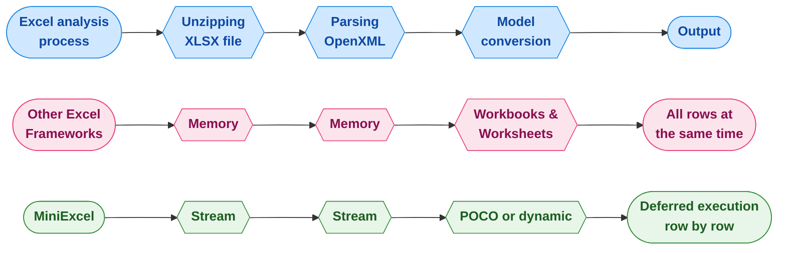

## MiniExcel

<div>
    <a href="https://www.nuget.org/packages/MiniExcel">
        
    </a>
    <a href="https://www.nuget.org/packages/MiniExcel">
        
    </a>
    <a href="https://ci.appveyor.com/project/mini-software/miniexcel/branch/master">
        
    </a>
    <a href="https://gitee.com/dotnetchina/MiniExcel">
        
    </a>
    <a href="https://github.com/mini-software/MiniExcel" rel="nofollow">
        
    </a>
    <a href="https://www.nuget.org/packages/MiniExcel">
        
    </a>
    <a href="https://deepwiki.com/mini-software/MiniExcel">
        
    </a>
</div>

---

MiniExcel is a simple and efficient Excel processing tool for .NET, specifically designed to minimize memory usage.

At present, most popular frameworks need to load all the data from an Excel document into memory to facilitate operations, but this may cause memory consumption problems. MiniExcel's approach is different: the data is processed row by row in a streaming manner, reducing the original consumption from potentially hundreds of megabytes to just a few megabytes, effectively preventing out-of-memory(OOM) issues.



### Features

- Minimizes memory consumption, preventing out-of-memory (OOM) errors and avoiding full garbage collections
- Enables real-time, row-level data operations for better performance on large datasets
- Supports LINQ with deferred execution, allowing for fast, memory-efficient paging and complex queries
- Lightweight, without the need for Microsoft Office or COM+ components, and a size under 800KB
- Simple and intuitive API style to import, export, and template Excel worksheets

### Quickstart

#### Importing

You can query worksheets and map the data either to strongly typed classes or dynamic objects:

```csharp
public class UserAccount
{
    public Guid ID { get; set; }
    public string Name { get; set; }
    public DateTime DateOfBirth { get; set; }
    public int Age { get; set; }
    public bool Vip { get; set; }
    public decimal Points { get; set; }
}

var userRows = MiniExcel.Query<UserAccount>(path);

// or simply

var dynamicRows = MiniExcel.Query(path);
```

#### Exporting

There are multiple ways to exprt data to an Excel document:

```csharp
// From strongly typed objects

var values = new[]
{
    new { Name = "MiniExcel", Value = 1 },
    new { Name = "Github", Value = 2 }
};
MiniExcel.SaveAs(yourPath, values);


// From anonymous objects

public class TestType
{
    public string Name { get; set; }
    public int Value { get; set; }
}

TestType[] values =
[
    new TestType { Name = "MiniExcel", Value = 1 },
    new TestType { Name = "Github", Value = 2 }
];
MiniExcel.SaveAs(yourPath, values);


//From a IEnumerable<IDictionary<string, object>>

new List<Dictionary<string, object>>() dicts =
[
    new Dictionary<string, object> { { "Name", "MiniExcel" }, { "Value", 1 } },
    new Dictionary<string, object> { { "Name", "Github" }, { "Value", 2 } }
];
MiniExcel.SaveAs(yourPath, dicts);


// Directly from a IDataReader

using var connection = yourConnectionProvider.GetConnection();
connection.Open();

using var cmd = connection.CreateCommand();
cmd.CommandText = """
    SELECT 'MiniExcel' AS "Name", 1 AS "Value"
    UNION ALL
    SELECT 'Github', 2
    """;

using var reader = cmd.ExecuteReader();
MiniExcel.SaveAs(yourPath, reader);


// From a DataTable

var table = new DataTable();
table.Columns.Add("Name", typeof(string));
table.Columns.Add("Value", typeof(int));
table.Rows.Add("MiniExcel", 1);
table.Rows.Add("Github", 2);

MiniExcel.SaveAs(path, table);
```
